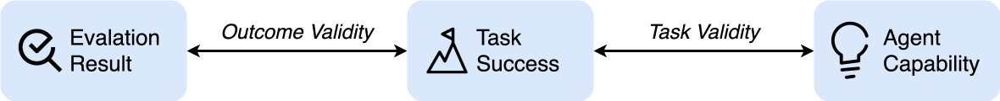

 

<h1> 
Establishing Best Practices for Rigorous Agentic Benchmarks
</h1>

    Yuxuan Zhu1, Tengjun Jin1, Yada Pruksachatkun,
    Andy Zhang2, Shu Liu3, Sasha Cui4, 
    Sayash Kapoor5, Shayne Longpre6, Kevin Meng7, 
    Rebecca Weiss8, Fazl Barez8, Rahul Gupta9, 
    Jwala Dhamala9, Jacob Merizian10, Mario Giulianelli10,
    Harry Coppock10, Cozmin Ududec10, Jasjeet Sekhon4, 
    Jacob Steinhardt7, Sarah Schwettmann7, 
    Matei Zaharia3, Ion Stoica3, Percy Liang2, 
    Daniel Kang1

1  &emsp;
2  &emsp;
3  &emsp;
4  &emsp;
5  &emsp;
6  &emsp;

7  &emsp;
8  &emsp;
9  &emsp;
10  &emsp;

  <a href="#" class="pill-button">Paper</a>
  <a href="https://github.com/uiuc-kang-lab/agentic-benchmarks/tree/main" class="pill-button">Repository</a>
  <a href="assets/checklist.pdf" class="pill-button">Checklist</a>

## Problem

As AI agents move from research demos to real-world assistants, the only way to 
know what they can (and cannot) do is to test them. Benchmarks have been 
developed as a way to benchmark the high-level capabilities and shortcomings of 
various agentic frameworks and base models, and are crucial in steering research, 
shaping product roadmaps, and helping customers pick the right model.
However, these benchmarks often contain flaws that lead to major misrepresentation 
in performance of up to 40% on popular benchmarks such as SWE-bench-Verified and τ-bench.

## Taxonomy

We identify two major challenges in creating rigorous agentic benchmarks:

1. Task Validity: a task should be solvable if and only if the agent 
    possesses the target capability. 
2. Outcome Validity: the evaluation method (e.g., tests or checks) should 
   indicate correctly whether the task has been solved.

## Checklist Assessment

We develop the [Agentic Benchmark Checklist (ABC)](assets/checklist.pdf), consisting of concrete and
actionable guidelines to ensure outcome and task validity. In cases where 
perfect guarantees of outcome and task validity are particular challenging
or impossible, we also provide 
guidelines to ensure the quality and rigor of benchmark reporting.

We apply ABC on ten widely used agentic benchmarks:

{{ read_csv('assets/scores.csv', colalign=("center", "center", "center", "center", "center",)) }}

Based on our analysis, we suggest the following best practices for benchmark developers:

1. Use process-based evaluation metrics alongside outcome-based metrics. 
2. Benchmark your LLM-as-a-judge in a reproducible manner. Tools such as <a href="https://aligneval.com/">AlignEval</a> can help with evaluating your LLM evaluator.
3. If possible, use frozen websites for tasks that require navigation and website reading.

## Contribute to the Agent Benchmark Checklist
Upholding the validity of agentic benchmarks requires effort from the broader scientific community. If you’re passionate about reliable evaluation in AI, we’d love your help.

Here’s some ways to get involved:

1. Apply the checklist to an existing benchmark - submit [here](https://forms.gle/BRrVh8McQaq8tnGc8).

2. Contribute proof-of-concept exploits and fixes for those exploits in our [repo](https://github.com/uiuc-kang-lab/agentic-benchmarks).

3. Give feedback on the checklist itself [here](https://forms.gle/xbGkqVksEH4fTajF8).